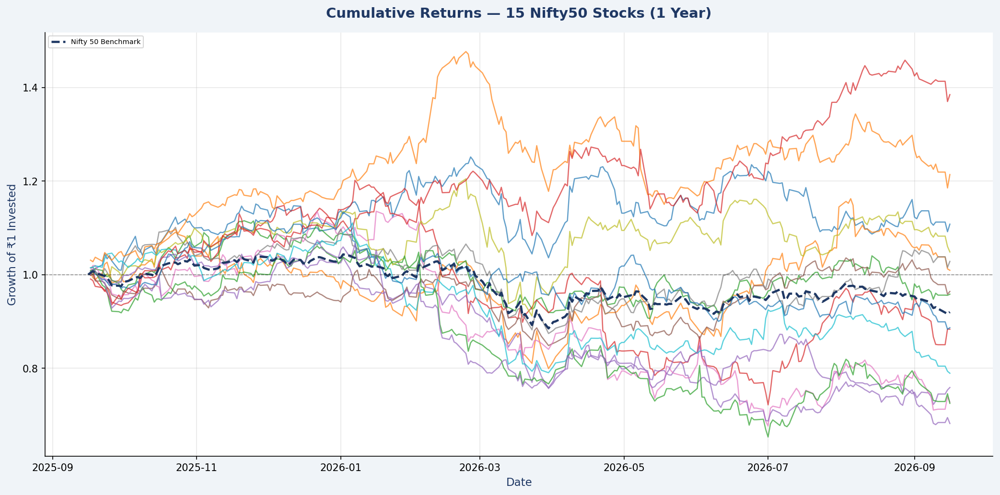
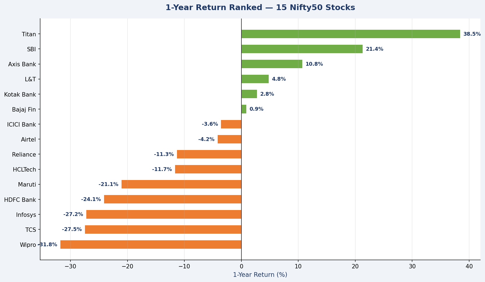
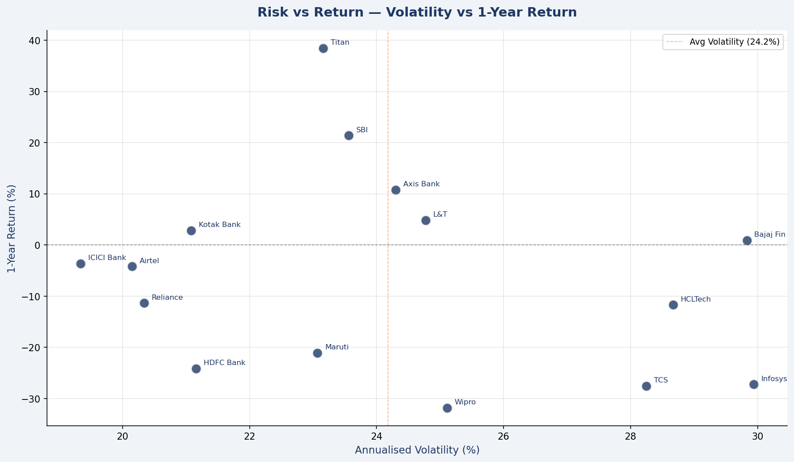
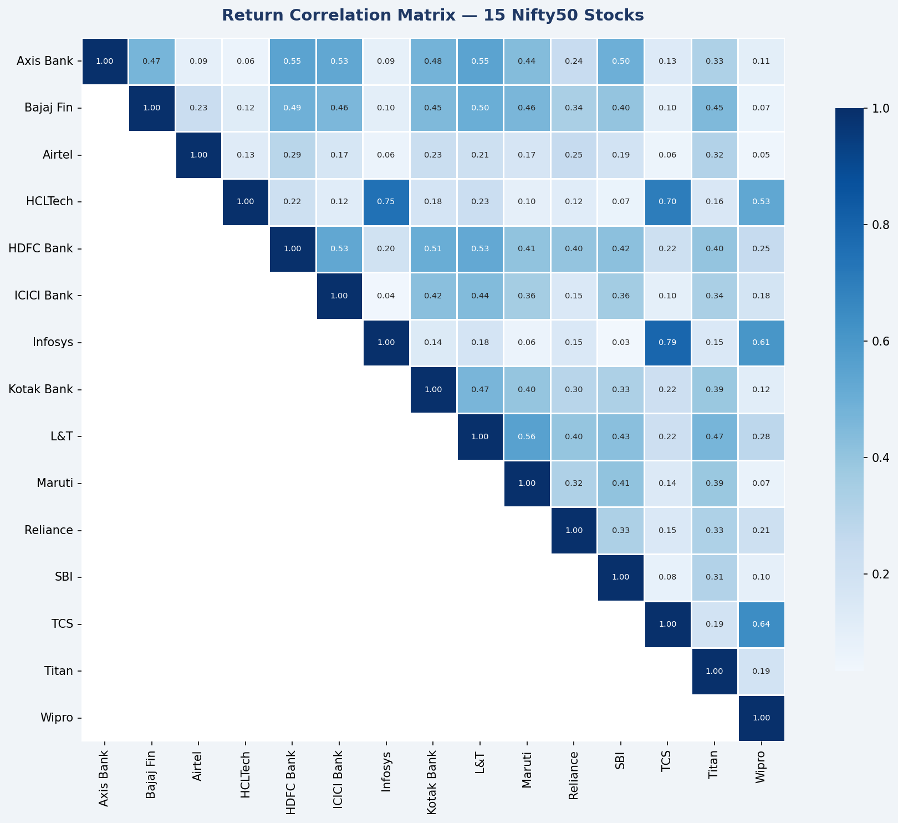
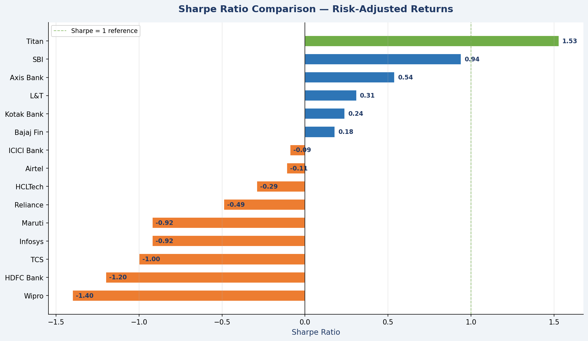
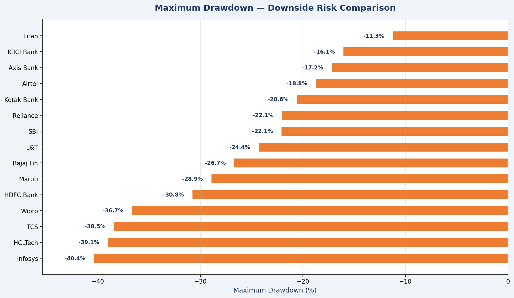

# Nifty50 Equity Peer Comparison — Python

## 🔗 Repository
Automated equity benchmarking analysis pulling live market 
data via API and generating 6 analytical charts.

## Project Overview
Peer benchmarking analysis of 15 Nifty50 stocks using Python. 
Pulls 1-year live price data via yfinance API, compares each 
stock against the Nifty50 benchmark index, and generates 6 
charts covering absolute returns, risk-adjusted performance, 
correlation structure, and downside risk.

## Tools & Libraries
- **Python 3** — core scripting
- **yfinance** — live market data via Yahoo Finance API
- **Pandas** — data manipulation and metric calculation
- **Matplotlib** — chart generation (5 custom charts)
- **Seaborn** — correlation heatmap

## Stocks Analysed (15 Nifty50 constituents)
Titan · SBI · Axis Bank · L&T · Bajaj Finance · Kotak Bank ·  
ICICI Bank · Airtel · Reliance · HCLTech · Maruti · HDFC Bank ·  
TCS · Infosys · Wipro

**Benchmark:** Nifty50 Index (^NSEI)

---

## Metrics Calculated

| Metric | Description |
|---|---|
| 1Y Return (%) | Total price return over 1 year |
| Excess Return (%) | Return above/below Nifty50 benchmark |
| Volatility (%) | Annualised standard deviation of daily returns |
| Sharpe Ratio | Risk-adjusted return (return per unit of risk) |
| Max Drawdown (%) | Largest peak-to-trough decline during the period |
| Avg Daily Vol (%) | Average daily price movement |

---

## Analysis & Visualisations

### Chart 1 — Cumulative Returns vs Nifty50 Benchmark
Tracks growth of ₹1 invested in each stock vs the Nifty50 
index (dashed navy line) over 1 year.



### Chart 2 — 1-Year Return Ranked
All 15 stocks ranked from best to worst absolute return.
Green = positive, Orange = negative.



### Chart 3 — Risk vs Return Scatter
Each stock plotted by annualised volatility (X) vs 1-year 
return (Y). Orange dashed line = average volatility.
Top-left quadrant = best risk-adjusted performers.



### Chart 4 — Return Correlation Matrix
Pairwise return correlations across all 15 stocks.
Darker blue = higher correlation = less diversification benefit.



### Chart 5 — Sharpe Ratio Comparison
Risk-adjusted return ranking. Green = Sharpe above 1,
Blue = 0 to 1, Orange = negative Sharpe.



### Chart 6 — Maximum Drawdown Comparison
Peak-to-trough decline for each stock during the period.
Measures downside risk and capital protection quality.



---

## Key Findings

| Finding | Detail |
|---|---|
| Nifty50 Benchmark Return | **-8.01%** (falling market) |
| Best absolute return | **Titan +38.5%** (+46.5% vs benchmark) |
| Only stock with Sharpe > 1 | **Titan (1.53)** |
| Best capital protection | **Titan — max drawdown only -11.3%** |
| 2nd best performer | **SBI +21.4%** (+29.4% vs benchmark) |
| Worst performer | **Wipro -31.8%** (-23.8% vs benchmark) |
| IT sector dominates bottom 4 | Wipro · TCS · Infosys all below -27% |
| Worst drawdown | **Infosys -40.4%** peak-to-trough |
| Highest IT correlation | **Infosys & TCS: 0.79** — move in near lockstep |
| Best diversifier | **Airtel** — lowest correlation with most stocks |
| Stocks beating benchmark | **6 of 15** outperformed the falling Nifty50 |

---

## Performance Summary Table
Full metrics in `peer_comparison_summary.csv`:
1Y Return · Excess Return · Volatility · Sharpe Ratio ·  
Max Drawdown · Avg Daily Volatility for all 15 stocks.

---

## How to Run
```bash
pip install yfinance pandas matplotlib seaborn
python3 nifty_analysis.py
```
**Note:** Data is pulled live from Yahoo Finance — results 
will update each time the script runs based on current 
market prices.
